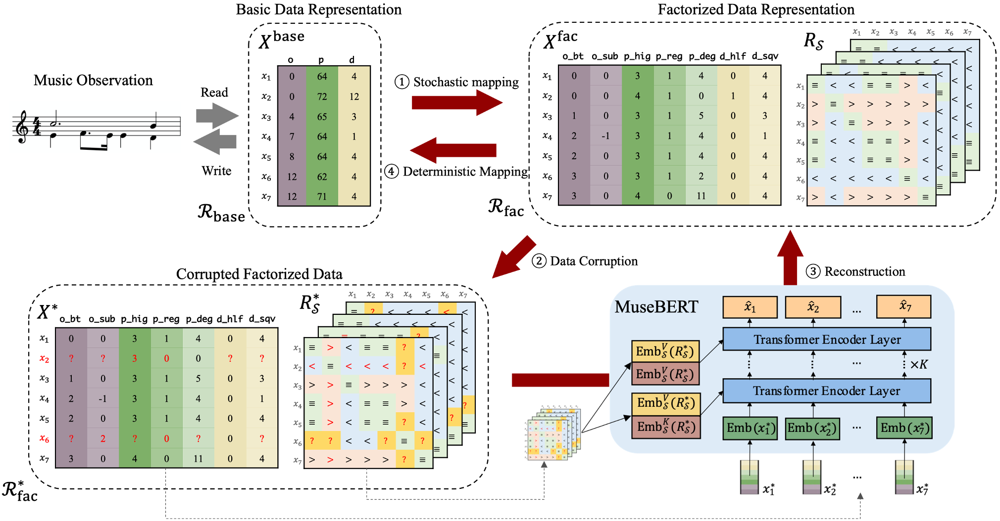

# MuseBERT

The code repository of the paper: 

> Z.Wang and G.Xia, MuseBERT: Pre-training of Music Representation for Music Understanding and Controllable Generation, ISMIR 2021.


## The workflow of MuseBERT

In this initial commit, we open source the core of MuseBERT: the entire workflow of MuseBERT. The workflow is used in both pre-training and fine-tuning. It contains four steps:

1. **Stochastic mapping**: $X^\text{base}$ is a note matrix of size $(L, 3)$ consisting of $L$ notes and $3$ attributes of onset, pitch and duration. It is stochastically converted to more detailed note attributes $X^{\text{fac}}$ of size $(L, 7)$, together with a stack of relation matrices $R_\mathcal{S}$ of size $(4, L, L)$.
2. **Data corruption**: Data corruption is applied in BERT-like fashion where 1) note attributes are masked/replaced/kept at random. Relation matrices are recomputed (because there are replaced attributes) and masked at random.
3. **Reconstruction**: MuseBERT model is applied to reconstruct the input $X^\text{fac}$, where masked attributes are fed as model input and corrupted relations are fed as generalized relative positional encoding.
4. **Deterministic Mapping**: the reconstructed factorized data is decoded back to $X^\text{base}$.




There are several implementation details worth-mentioning:

1. MuseBERT does not use absolute positional encoding.
2. In practice, data corruption over relation matrices are not recomputed. We first compute the relation matrices based on a replaced-only $X^*$ (an intermediate product) and then apply mask corruption by generating a stack of symmetrical masks.
3. We propose novel *Generalized Relative Positional Encoding* introduced in eq. (10) & (11) of our paper. The direct implementation is not affordable in time complexity. We therefore implement GRPE in an effficient way:
   * We uses distributive law to both eq. (10) & (11).
   * Since the embedding of the same relation (e.g., $<$) will be used in many place, we compute it only once and avoid expanding relation matrices embedding into $(L, L, \text{emb_dim})$.
4. Loss is applied to corrupted tokens only. In our implementation, we compute the loss in the fashion where each segment (in a batch) is treated *equally* regardless of the different number of corrupted tokens. For example, bs=2, $N_1$ sample in sample 1, and $N_2$ samples in sample 2, the weighting is: `[0.5 / N_1]* N_1 + [0.5 / N_2] * N_2`.


## Files

A brief introduction of what is in each file:

* `note_attribute_repr.py`: converting between $X^\text{base}$ to $X^\text{fac}$.
* `note_attribute_corrupter.py`: computing relation matrices and data corruption.
* `transformer.py`: implementatino of GRPE and a modified Transformer encoder.
* `musebert_model.py`: implementation of MuseBERT model.
* `curriculum_preset`: preset hyperparameters of MuseBERT workflow, model architecture and training.
* `curricula.py`: handling of hyperparameters for different presets for pre-training and different types of fine-tuning.
* `dataset.py`, `utils.py`, `train.py` etc.


## Training

```(python)
python train.py
```


## Thoughts & Future Plan

As stated in our paper as well, we see our model as a powerful controllable music generator and analyzer. However, it is still in its perliminary stage. We plan to update the code including more downstream fine-tuning tasks, and a more complete illustration of the entire MuseBERT methodology. 

The paper is written in a very rigorous manner with clear definition and theorem proving, which is very rare in music generation studies. Nevertheless, we believe this is a proper way to present our work in the  sense that our model adds music control from the token-wise/lexeme level of music, and an isomorphism is made between a BERT problem and a way of generalized positional encoding, and between a BERT problem and a constraint solver.


Problems and discussion on this paper is welcome. Please contact me at [ziyu.wang@nyu.edu](ziyu.wang@.nyu.edu).

